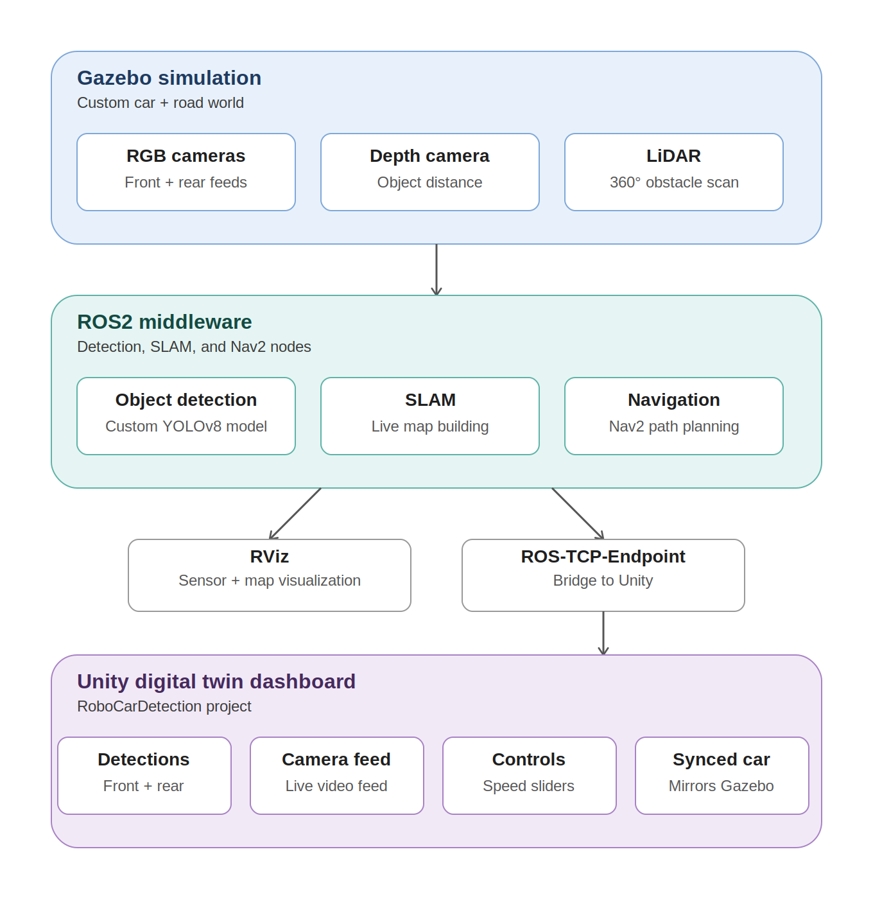

# Autonomous Robotics, AI, Vision & Simulation Platform

### ROS2 · Gazebo · YOLOv8 · SLAM · Nav2 · Unity 3D · Reinforcement Learning

**Author:** Md. Rafiqul Islam | Bangladesh University of Textiles (BUTEX)  
**Period:** July 2026 – Present

---

## Overview

A complete perception-to-autonomy simulation framework for an autonomous ground vehicle, integrating ROS2 Humble with Gazebo Classic and Unity 3D.

The vehicle senses its environment through dual RGB cameras, an RGB-D depth camera, and a 360° LiDAR; detects and localizes objects using a custom-trained YOLOv8 model; builds a live map of its surroundings using SLAM; and navigates autonomously using Nav2.

The complete simulation is mirrored in a Unity-based digital twin dashboard with live monitoring and bidirectional teleoperation. The project is now being extended with reinforcement learning as an alternative control layer for autonomous obstacle avoidance.

---

## Objectives

- Build a custom autonomous ground vehicle in Gazebo with a complete sensor suite
- Detect and classify environmental objects using a custom-trained computer vision model
- Reduce the simulation-domain detection gap between pretrained models and synthetic Gazebo objects
- Estimate metric distance and 3D position of detected objects
- Build a live occupancy map from LiDAR and odometry
- Enable autonomous goal-based navigation with dynamic obstacle avoidance
- Mirror the simulation in a Unity digital twin with live monitoring and control
- Explore reinforcement-learning-based vehicle control using Python RL and Unity ML-Agents

---


## Aechitecture Diagram


# Results

## Stage 1 — Vehicle, Sensors & Environment

- ✅ Custom differential-drive vehicle built from scratch in URDF, including chassis, four wheels, and differential-drive control
- ✅ Integrated dual RGB cameras: front and rear
- ✅ Integrated RGB-D depth camera
- ✅ Integrated 360° LiDAR
- ✅ Fully simulated sensor suite in Gazebo Classic
- ✅ Custom road environment containing asphalt lane markings, buildings, trees, and three textured detection objects: cone, can, and cube
- ✅ Collision geometry verified and corrected for environment assets
- ✅ Fixed an important simulation issue where buildings and trees initially had visual-only geometry, causing LiDAR and Nav2 to effectively see through them

---

## Stage 2 — Object Detection & Simulation-Domain Gap

- ✅ Diagnosed a genuine simulation-domain detection gap: a pretrained YOLOv8n model consistently misclassified the simulation's plain synthetic objects, including cases such as cone → stop sign with confidence below 0.4
- ✅ Developed a fully automated ground-truth labeling pipeline using:
  - Known object positions in the world frame
  - Vehicle odometry
  - Camera pose
  - Camera intrinsics
  - 3D-to-2D projection
- ✅ Generated YOLO-format training labels automatically without manual bounding-box annotation
- ✅ Built a custom YOLOv8 training dataset containing **106 source images with corresponding labels**
- ✅ Fine-tuned a custom YOLOv8 model on the automatically generated dataset
- ✅ Achieved **mAP50 = 0.845** overall
- ✅ Achieved class-level mAP50 of:
  - Cone: **0.995**
  - Can: **0.995**
  - Cube: **0.546**
- ✅ Verified that the fine-tuned model correctly classifies the three target objects during live Gazebo simulation using both front and rear cameras
- 🔄 Cube detection remains weaker than cone and can and requires additional training data and variation

---

## Stage 3 — Localization, Mapping & Navigation

- ✅ Integrated RGB-D sensing for metric distance estimation to detected objects
- ✅ Implemented 3D object localization using pinhole-camera back-projection
- ✅ Published detected-object positions as live pose/confidence markers in RViz
- ✅ Integrated `slam_toolbox` for live LiDAR + odometry-based mapping
- ✅ Generated a usable occupancy grid while the vehicle drives through the environment
- ✅ Integrated Nav2 for autonomous goal-based path planning
- ✅ Configured live costmaps for obstacle-aware navigation
- ✅ Verified autonomous navigation by setting a 2D goal pose in RViz
- ✅ Vehicle successfully navigates toward goals while avoiding the cone, can, and cube obstacles

---

## Stage 4 — Unity Digital Twin Dashboard

- ✅ Developed a separate Unity project, `RoboCarDetection`
- ✅ Connected Unity to ROS2 using the ROS-TCP-Connector
- ✅ Streamed live object-detection results from ROS2 to Unity as JSON over a custom ROS2 topic
- ✅ Rendered live front and rear camera feeds directly in Unity
- ✅ Implemented ROS image → Unity `Texture2D` conversion
- ✅ Implemented bidirectional control between Unity and ROS2
- ✅ Unity UI sliders publish `/cmd_vel` commands to the simulated vehicle
- ✅ Imported the URDF vehicle into Unity
- ✅ Synchronized the Unity vehicle pose with the Gazebo vehicle using `/odom`
- ✅ Configured a static IP for the ROS-TCP bridge to improve connection reliability across sessions

---

## Stage 5 — Reinforcement Learning

### Python RL — LiDAR Obstacle Avoidance

- ✅ Developed a custom Gymnasium environment wrapping ROS2
- ✅ Used `/scan` LiDAR data as the observation space
- ✅ Used `/cmd_vel` as the vehicle action interface
- ✅ Integrated Stable-Baselines3 PPO for reinforcement learning
- ✅ Trained the policy for **20,000 timesteps directly against the live Gazebo simulation**
- ✅ Average episode reward improved from approximately **0 to 46.8**
- ✅ Average survival length improved from approximately **20 steps to 291/300 steps**
- 🔄 Current PPO policy demonstrates measurable learning but remains undertrained for consistently reliable autonomous driving
- 🔄 Additional training and reward/environment refinement are planned

### Unity ML-Agents

- 🔄 Unity ML-Agents integration is in progress
- 🔄 A second reinforcement-learning policy is being developed directly in Unity physics using the corresponding vehicle model
- 🔄 Digital-twin synchronization is temporarily disabled during ML-Agents training and will be re-enabled afterward

---

# Known Limitations

### 1. Cube Detection

The cube class currently has substantially weaker detection performance:

- Cone: **mAP50 = 0.995**
- Can: **mAP50 = 0.995**
- Cube: **mAP50 = 0.546**

The current dataset likely needs additional cube samples across different distances, viewpoints, orientations, and environmental conditions.

---

### 2. Reinforcement Learning

The current PPO policy demonstrates clear learning but is still at an early stage.

The 20,000-timestep experiment provides evidence that the agent can learn LiDAR-based obstacle avoidance, but the policy has not yet reached the level of robustness required for reliable autonomous driving.

Further training, reward shaping, environment randomization, and evaluation are planned.

---

### 3. Simulation-Only Validation

The complete system is currently validated in simulation.

Sensors, vehicle dynamics, objects, perception, SLAM, navigation, and reinforcement learning are all evaluated using simulated environments. No real-world hardware validation has yet been performed.

Therefore, real-world transfer performance remains unverified.

---

### 4. Development Environment Fragility

The development environment is currently based on:

- VirtualBox
- Ubuntu
- ROS2 Humble
- Gazebo Classic

Development required several manual fixes involving package and dependency compatibility, including NumPy, OpenCV, PyTorch, and setuptools.

The project is reproducible within the current development environment, but it is not yet containerized with Docker for simplified deployment on another machine.

---

### 5. Environment Geometry

Building and tree collision geometry was manually created and approximately defined rather than derived from precise real-world measurements.

This is sufficient for the current simulation experiments but may limit physical realism.

---
## Technology Stack

ROS2 Humble · Gazebo Classic · RViz · Nav2 · slam_toolbox · YOLOv8 · OpenCV · PyTorch · Gymnasium · Stable-Baselines3 · PPO · Unity 2022 LTS · ML-Agents · C# · Python · URDF


## Repository Structure

```text
crr_ws/
├── config/
├── dataset/
│   ├── images/
│   ├── labels/
│   └── data.yaml
├── src/
│   └── car_perception/
│       └── car_perception/
│           └── rl_env.py
├── urdf/
├── worlds/
│   └── road_world.world
├── custom_models/
├── custom_yolo.pt
├── train_rl.py
├── run_rl.py
├── rl_lidar_avoidance.zip
└── unity/
    └── RoboCarDetection/


